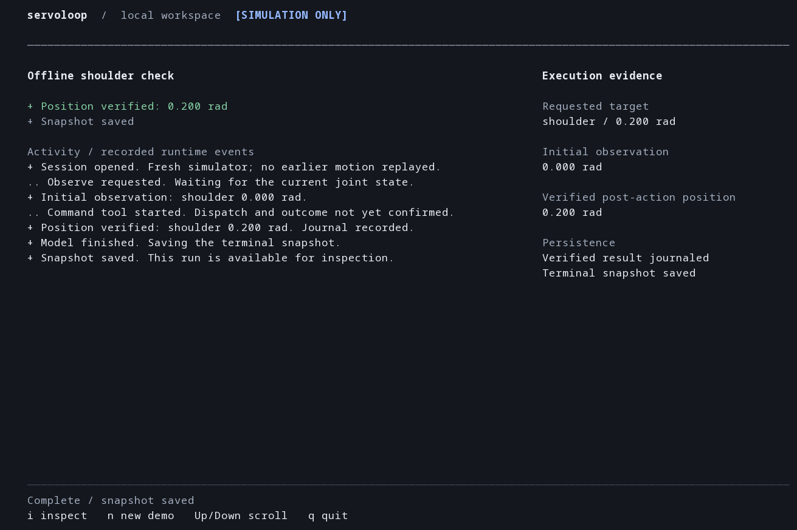
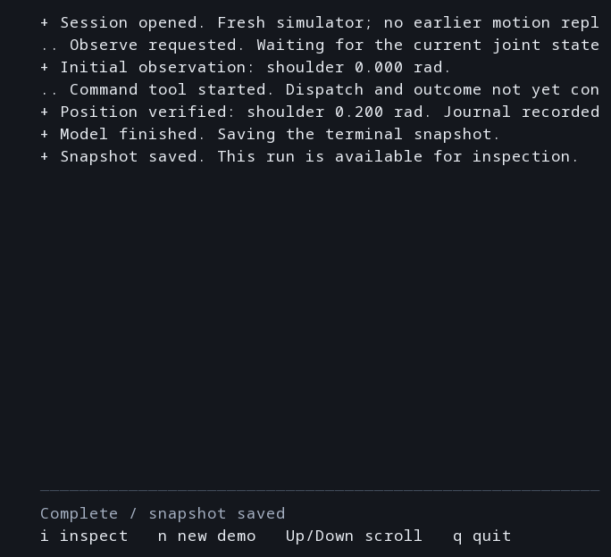

# Terminal workspace: audit and first implementation

The selected direction is a compact, keyboard-first terminal workspace over
the existing CLI runtime. The first implementation is opt-in through
`servoloop ui`; existing `run`, `resume`, discovery, configuration, and session
commands retain their interfaces and output formats.

These previews are rasterized from actual tmux ANSI captures of the passing
offline-demo smoke test. Font appearance depends on your terminal emulator.





## Evidence and scope

The review used the supplied Paper file, **Nimble lemon / ServoLoop — user
journeys**, including its 18 primary screens and 11 supporting frames. Its
content was inspected along with full-scale visual samples and the current
Rust implementation. The Paper board remains unchanged as the original
reference; the improvements described here are implemented in the terminal UI.

The user approved this first slice: welcome, explicit offline-demo review,
execution activity, and evidence inspection. Provider configuration, persistent
free-form conversation, saved-session navigation, and updates remain later
work, not disabled controls masquerading as implemented features.

The working context is a developer using a local terminal alongside code and
logs. The design preserves the board's restrained dark/blue direction, while
providing a light palette for bright environments and monochrome output for
user-controlled terminal colors. No user research or real simulator validation
is claimed.

## Audit findings

The existing design has strong safety language: unknown outcomes are explicit,
recovery never implies motion replay, and physical results are separated from
storage results. Preserve those principles. Its main weakness is the gap
between the proposed interaction and the implemented runtime, not a need for
more decoration.

| Priority | Evidence | Correction |
| --- | --- | --- |
| P1 | The ready/demo screen offers arbitrary prompts, but `DemoModel` always runs a fixed script. | Show the exact shoulder target and require explicit submission. Do not present a free-form composer for this slice. |
| P1 | The running mockup shows independent validation, intent, and dispatch stages that are not independently emitted by the current runtime. | Render only observed runtime events. A command-tool start does not prove dispatch. |
| P1 | The existing top-level `verified` NDJSON event is emitted on model completion, not exclusively on verified motion. | The UI ignores that envelope as physical evidence. It requires an accepted command with a finite, target-matching post-action observation. The legacy stream is unchanged for compatibility. |
| P1 | Back and cancellation shortcuts recur across the mockups without terminal-level interaction proof. | Escape changes views only. Ctrl+C requests cancellation and remains available while inspecting; quitting waits for cleanup. |
| P2 | Repeated headers, footers, notices, and bordered blocks compete with the actual run evidence. | Use one persistent context header, one status/shortcut footer, a transcript, and an on-demand inspector. Wide activity views add a compact evidence column. |
| P2 | Setup, update, and recovery states imply capabilities beyond the first runnable CLI slice. | Keep them in the design backlog. Do not ship fake network checks, updates, or reconciliation controls. |
| P2 | A narrow visual mockup does not establish terminal resize, paste, or input behavior. | Add rendered-buffer tests and a real PTY test, including resizing while the app is open and refusing hidden motion shortcuts. |

No overall WCAG or performance score is assigned to the Paper mockups. Static
frames do not establish keyboard support, screen-reader behavior, terminal
font rendering, or runtime performance. Color-role tests check at least 4.5:1
sRGB contrast against the explicit dark/light backgrounds; actual terminal
color management and monochrome contrast remain environment-dependent.

## Implemented flow

The terminal workspace keeps navigation shallow:

```text
Welcome --Enter--> Review fixed demo --r--> Activity
   |                    |                    |
   ?                    Esc                  i
   |                    |                    |
  Help <------------- Welcome             Inspector
                                             |
                                            Esc
                                             |
                                          Activity
```

After successful completion, **n** opens a new review; it does not execute
another run. Each confirmed demo uses a new session and fresh simulator.
Failures and interruptions expose inspection and exit, never a replay action.
Pasting text cannot confirm the demo. Shrinking below 48×18 disables hidden
actions while keeping cancellation and exit available.

## State and evidence rules

The presentation state is intentionally distinct from command execution:

- **Ready:** No session or command is created by opening or reviewing the UI.
- **Running:** A fixed demo uses the shared agent loop and journal decorator.
  Tool-start events are requests, not proof of dispatch or success.
- **Cancelling:** The cancellation token is signaled once semantically; the
  view remains open while the shared runner performs cleanup. Escape is not
  cancellation, and cancellation is not rollback or a certified stop.
- **Complete:** The terminal snapshot was saved. Position verification and
  journal persistence are shown separately, based on tool evidence.
- **Failed/interrupted:** Verified observations, if any, remain visible without
  claiming the final snapshot was saved. No automatic motion retry is offered.
  If storage setup failed before the run opened, the UI says so
  rather than implying that a journal necessarily exists.

Activity presentation retains at most 64 entries and 512 display characters
per entry. Older display entries are counted, not silently presented as a full
trace. Control and bidirectional-formatting characters are removed from
diagnostics; configured credential values are redacted. This is a bounded
display policy, not a replacement for the store's retention policy.

## Implementation boundaries

The code separates responsibilities without duplicating the execution engine:

- `apps/servoloop-cli/src/ui/mod.rs`: navigation, asynchronous input, terminal
  lifecycle, cancellation, and background-run ownership.
- `apps/servoloop-cli/src/ui/state.rs`: bounded presentation state and
  evidence-based event interpretation.
- `apps/servoloop-cli/src/ui/view.rs`: terminal layouts and semantic palettes.
- `apps/servoloop-cli/src/execution.rs`: shared model, tool, journal, snapshot,
  and cleanup path for both terminal and scriptable runs.
- `apps/servoloop-cli/src/output.rs`: separate NDJSON and terminal output sinks.

The implementation uses Ratatui 0.29 and Crossterm 0.28. Input uses Crossterm's
asynchronous event stream so resize events do not stall key handling. The
Ratatui rendered-line-count feature is enabled to bound paragraph scrolling.
The workspace's Rust 1.88 minimum remains unchanged and is checked with the
updated lockfile.

## Verification and remaining work

The first slice has local Linux evidence for:

- Unit/integration tests for navigation, shared runtime execution, no-TTY
  rejection, cancellation before dispatch, storage setup failure, evidence
  semantics, and independent snapshot failure.
- Rendering at 120×34, 80×24, 60×24, 48×18, and the undersized fallback.
- Real tmux PTY interaction for preview, paste, demo execution, journal and
  snapshot creation, inspection, resizing, themes, failures, and terminal-mode
  restoration. Missing tmux fails the test explicitly rather than silently
  skipping it.

The CI workflow adds a Linux PTY job and uploads its text/ANSI captures. Existing
cross-platform Rust jobs exercise compilation and rendered-buffer tests, not
real Windows/macOS terminal interaction. No actual Isaac Sim, GPU, model API,
hardware, screen reader, or live update installation was tested.

Next work should add typed phase/outcome events before richer progress UI,
then provider configuration and conversation. Resume preflight must preserve
the current no-replay and journal-consistency checks. Updating the legacy
`verified` event requires an explicit compatibility plan rather than a visual
rename inside this feature.
